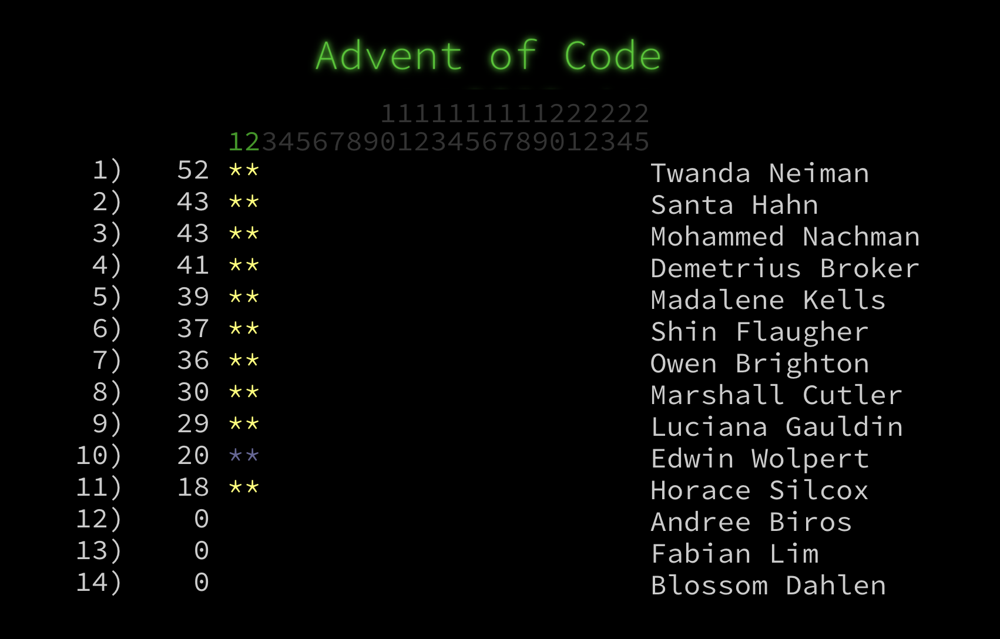

# MagicMirror² Module: AoC (Advent of Code)
MagicMirror² module for Advent of Code leaderboards.



## Installation

Remote to your MM2-box with your terminal software and go to your MagicMirror's Module folder:
````bash
cd ~/MagicMirror/modules
````

Clone the repository:
````bash
git clone https://github.com/JonasTriki/MMM-AoC.git
````

Go to the modules folder:
````bash
cd MMM-AoC
````

Install the dependencies:
````bash
npm install
````

Add the module to the modules array in the `config/config.js` file by adding the following section. You can change this configuration later when you see this works:
```
{
	module: "MMM-AoC",
	position: "middle_center",
	config: {}
},
```

# Configuration options

These are the valid configuration options you can put inside the config array above:

Configuration option | Comment | Default 
---|---|---
updateInterval | Refresh rate in MS for how often we call the API's. Don't set this too low. | 900000
year | What AoC year. | 2018
leaderboardId |  **Required**: id to specify what leaderboard we wish to tablulate from. | ""
sessionCookie | **Required**: Valid session cookie from signed in user (lasts 1 month, just sign in and copy-paste yours). | ""

## Translations

This modules is translated to the following languages:

Language | Responsible
---|---
en (English) | Jonas Triki
nb (Norwegian) | Jonas Triki

If you wish to contribute, please make a pull request.

# Current development status

This module is currently being maintained, weyy! 🎉